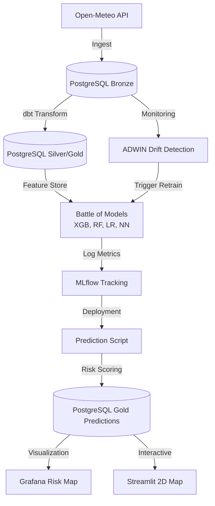

# Samarinda Flood Intelligence - Demo Praktisi Mengajar 🌊

Sistem deteksi dini banjir bertenaga AI yang dirancang khusus untuk kurikulum **Praktisi Mengajar**. Proyek ini mengimplementasikan siklus **End-to-End Data Science (EDSL)** menggunakan teknologi MLOps standar industri namun tetap ringan (< 8GB RAM).

---

## 🧬 Arsitektur Sistem (Data Flow)



---

## 🛠️ Persiapan Awal (Untuk Mahasiswa)
Sebelum memulai, pastikan perangkat Anda sudah memiliki peralatan dasar berikut:

1.  **Instalasi Git**:
    - **Windows**: [git-scm.com](https://git-scm.com/download/win) (Pilih 64-bit Git for Windows Setup).
    - **Mac**: Buka terminal, ketik `git --version` (macOS akan menawarkan instalasi otomatis).
2.  **Instalasi Docker Desktop**:
    - Unduh di [docker.com/products/docker-desktop](https://www.docker.com/products/docker-desktop/). Ini adalah "Mesin" yang akan menjalankan seluruh AI dlm proyek ini.
3.  **Clone Proyek**:
    ```bash
    git clone https://github.com/amsopian22/demo-praktisi-mengajar.git
    cd demo-praktisi-mengajar
    ```

---

## 🚀 Jalur Cepat (Demo Mode)
Gunakan jalur ini jika Anda ingin langsung melihat hasil kerja AI dlm hitungan menit.

1.  **Nyalakan Infrastruktur** (7 Layanan dlm 1 Perintah):
    ```bash
    docker-compose up -d
    ```
2.  **Jalankan Robot Pelatihan AI** (Battle of Models):
    *Tunggu 1 menit agar database siap, lalu jalankan:*
    ```bash
    docker exec -u 50000 demo-prediksi-praktisi-mengajar-airflow-scheduler-1 python /opt/airflow/scripts/train_comparison_models.py
    ```
3.  **Buka Dashboard Utama**:
    - **Peta Risiko (Streamlit)**: [http://localhost:8501](http://localhost:8501)
    - **Laboratorium AI (MLflow)**: [http://localhost:5001](http://localhost:5001)

---

## 📦 Cara Mengisi Data (Initial Load)
Jika Anda baru pertama kali menjalankan proyek di komputer baru, database Anda akan **kosong**. Ikuti urutan ini untuk mengisi 2,6 Juta baris data historis:

1.  **Tarik Data Cuaca 5 Tahun** (Ingest dari Open-Meteo API):
    *Proses ini menggunakan teknologi `asyncio` agar penarikan jutaan baris tetap cepat.*
    ```bash
    docker exec -it demo-prediksi-praktisi-mengajar-airflow-scheduler-1 python /opt/airflow/scripts/ingest_open_meteo.py --initial
    ```
2.  **Masak Data Mentah** (Transformasi dbt):
    *Mengubah data mentah menjadi Feature Store di lapisan Silver & Gold.*
    ```bash
    docker exec -it demo-prediksi-praktisi-mengajar-airflow-scheduler-1 python /opt/airflow/scripts/run_elt_pipeline.py --layer gold
    ```
3.  **Latih Otak AI** (Battle of Models):
    *Melatih 4 model sekaligus (XGB, RF, LR, NN) dengan sampling 100k data.*
    ```bash
    docker exec -it demo-prediksi-praktisi-mengajar-airflow-scheduler-1 python /opt/airflow/scripts/train_comparison_models.py
    ```

---

## 🎓 Jalur Belajar: Menjadi Data Scientist Samarinda
Proyek ini membagi pekerjaan Data Science ke dalam **4 Tahap Besar** yang bisa dipelajari satu per satu.

### 🏮 Tahap 1: Ingest (Mengambil Bahan Mentah) 
**Analogi:** Seperti membeli sayuran di pasar yang masih ada tanahnya.
- **Teknologi**: Python `asyncio` & Open-Meteo API.
- **Tugas**: Mengambil data hujan & elevasi dari 59 Kelurahan Samarinda secara paralel (10x lebih cepat).
- **Lokasi Kode**: `scripts/ingest_open_meteo.py`

### 🥣 Tahap 2: Transformasi & dbt (Dapur Rekayasa Data)
**Analogi**: Membersihkan, memotong, dan memasak sayuran menjadi hidangan siap saji.
- **Konsep Medallion**:
    - **Bronze**: Data mentah dari API.
    - **Silver**: Data yang sudah dibersihkan (tanpa nilai kosong).
    - **Gold (Feature Store)**: Data "pintar" yang sudah dihitung akumulasi hujan 3, 7, dan 14 harinya.
- **Teknologi**: **dbt (Data Build Tool)** & PostgreSQL 16.
- **Poin Belajar**: Mahasiswa belajar SQL untuk "rekayasa fitur" (Feature Engineering).

### 🧠 Tahap 3: Battle of Models (Simulasi Ujian AI)
**Analogi**: Menguji 4 orang siswa (Model AI) dengan soal ujian banjir yang sama untuk melihat siapa yang paling pintar.
- **Para Kontestan**: **XGBoost, Random Forest, Logistic Regression, Neural Network**.
- **Metrik Kelulusan (F1-Score)**: Kita mencari keseimbangan antara **Precision** (Seberapa tepat ramalan AI?) dan **Recall** (Berapa banyak banjir yang tidak terlewatkan?).
- **Teknologi**: **MLflow** untuk mencatat hasil "ujian" secara otomatis.

### 🤖 Tahap 4: Orkestrasi (Si Manager Robot)
**Analogi**: Seperti manager restoran yang memastikan semua koki bekerja tepat waktu.
- **Teknologi**: **Apache Airflow**.
- **Tugas**: Membangunkan sistem setiap jam untuk mengambil cuaca terbaru, menyuruh AI meramal, dan mengirim hasilnya ke peta.
- **Visualisasi**: **Grafana** & **Streamlit** untuk memantau "Kesehatan" sistem secara real-time.

---

## 📊 Statistik Dataset Samarinda
| Parameter | Nilai |
| :--- | :--- |
| **Total Data** | ~2,6 Juta Baris (Per jam per lokasi) |
| **Lokasi** | 59 Kelurahan (Samarinda Hulu s/d Seberang) |
| **Model AI** | 4 Arsitektur Berbeda |
| **Efisiensi** | Mampu berjalan di RAM laptop < 8GB |

---

## 🚀 Akses Dashboard & Laboratorium
| Layanan | Browser URL | Gunanya Untuk Apa? |
| :--- | :--- | :--- |
| **Airflow** | `8080` | Melihat robot/otomasi berjalan. |
| **MLflow** | `5001` | Membandingkan nilai "Ujian" antar AI. |
| **Streamlit** | `8501` | Melihat peta risiko banjir interaktif. |
| **Grafana** | `3001` | Memantau statistik sistem Command Center. |
| **pgAdmin** | `5050` | Melihat isi "Gudang Data" (SQL). |

---

## 🖼️ Galeri Visual
- **Peta Risiko 2D Samarinda**: Visualisasi interaktif tiap Kelurahan di Streamlit.
- **Radar Performa AI**: Grafik perbandingan metrik evaluasi model di dashboard.
- **Pipeline Airflow**: Orkestrasi otomatis yang terintegrasi (Ingest s/d Predict).

---
**Dibuat dng ❤️ untuk Mahasiswa Indonesia - Selamat Belajar Data Science!**
