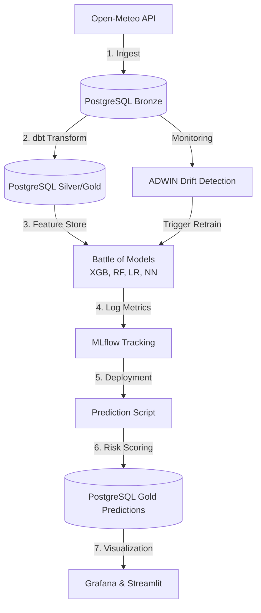

# Samarinda Flood Intelligence - Demo Praktisi Mengajar 🌊

Sistem deteksi dini banjir bertenaga AI yang dirancang khusus untuk kurikulum **Praktisi Mengajar**. Proyek ini mengimplementasikan siklus **End-to-End Data Science (EDSL)** menggunakan teknologi MLOps standar industri namun tetap ringan (< 8GB RAM).

---

## 🧬 Arsitektur Sistem (Data Flow)

Sistem ini didesain agar mahasiswa dapat memahami bagaimana data "mengalir" dari sensor internet hingga menjadi kebijakan di layar monitor.



---

## 🍳 Analogi "Dapur Data" (Agar Mudah Dipahami)

Bayangkan kita sedang mengelola sebuah restoran besar bernama **"Samarinda Flood Intelligence"**:

1.  **🏮 Tahap 1: Ingest (Belanja Bahan Mentah)**
    *   **Analogi**: Kita membeli sayuran dan daging dari pasar (API Open-Meteo). Bahannya masih kotor, ada tanahnya, dan belum dikelompokkan.
    *   **Simpan di**: **Tabel Bronze**.
2.  **🥣 Tahap 2: Transformasi (Memasak & Meracik)**
    *   **Analogi**: Kita mencuci sayuran (Cleaning), memotongnya (Transformation), dan meracik bumbu rahasia (Feature Engineering). Kita menyiapkan bahan siap saji yang lezat.
    *   **Simpan di**: **Tabel Silver & Gold**.
3.  **🧠 Tahap 3: Battle of Models (Ujian Koki)**
    *   **Analogi**: Kita punya 4 koki (XGBoost, RF, dll). Kita beri mereka bahan yang sama dan minta mereka menebak rasa masakan. Koki yang paling akurat (F1-Score tertinggi) akan terpilih jadi Koki Utama.
    *   **Catat di**: **MLflow**.
4.  **🤖 Tahap 4: Orkestrasi (Manager Restoran)**
    *   **Analogi**: Manager (Airflow) memastikan semua staf bangun jam 6 pagi, mulai memasak, dan menyajikan makanan tepat waktu ke meja pelanggan.
    *   **Tampilkan di**: **Dashboard**.

---

## 🛠️ Langkah Demi Langkah (Panduan Eksekusi)

### 1. Persiapan Lingkungan

Sebelum mulai, pastikan Anda sudah menginstal **Git** di laptop Anda.

#### 📦 Instalasi Git (GitHub)
*   **🪟 Windows**: Unduh di [git-scm.com](https://git-scm.com/download/win). Pilih "64-bit Git for Windows Setup". Instal dengan mengikuti petunjuk standar (klik Next sampai selesai).
*   **🍎 macOS**: Buka Terminal, ketik `git --version`. Jika belum ada, macOS akan meminta Anda menginstalnya secara otomatis (Xcode Command Line Tools).
*   **🐧 Ubuntu/Linux**: Buka Terminal, ketik: `sudo apt update && sudo apt install git -y`.

**Cek Hasil Instalasi**: Ketik `git --version` di terminal. Jika muncul angka versi (misal: `git version 2.x.x`), artinya Git sudah siap digunakan.

#### 🖥️ Panduan Dasar Terminal (Untuk Pemula)
Jika Anda belum pernah menggunakan terminal/command prompt, berikut cara membukanya:
*   **🪟 Windows**: Tekan tombol `Windows`, ketik **"PowerShell"**, lalu Enter.
*   **🍎 macOS**: Tekan `Command + Space`, ketik **"Terminal"**, lalu Enter.
*   **🐧 Ubuntu/Linux**: Tekan `Ctrl + Alt + T`.

#### 📥 Cara Mengunduh Proyek (Clone)
Buka terminal Anda, lalu ketik perintah berikut satu per satu:
```bash
git clone https://github.com/amsopian22/demo-praktisi-mengajar.git
cd demo-praktisi-mengajar
```

### 2. Jalankan Infrastruktur (Start Services)
Nyalakan seluruh layanan (Database, AI, dll) dengan satu perintah:
```bash
docker-compose up -d
```

### 3. Eksekusi Pipeline (Manual Trigger untuk Pertama Kali)
Jika database Anda masih kosong, ikuti urutan "memasak" data berikut:

| Langkah | Perintah (Jalankan di Terminal) | Apa yang terjadi? |
| :--- | :--- | :--- |
| **Ingest** | `docker exec -it demo-prediksi-praktisi-mengajar-airflow-scheduler-1 python /opt/airflow/scripts/ingest_open_meteo.py --initial` | Mengambil data cuaca 5 tahun untuk 59 kelurahan. |
| **Transform** | `docker exec -it demo-prediksi-praktisi-mengajar-airflow-scheduler-1 python /opt/airflow/scripts/run_elt_pipeline.py --layer gold` | Membersihkan dan merakit data menjadi fitur AI. |
| **Train AI** | `docker exec -it demo-prediksi-praktisi-mengajar-airflow-scheduler-1 python /opt/airflow/scripts/train_comparison_models.py` | Melatih 4 model AI sekaligus dan mencatatnya. |

---

## 🥇 Arsitektur Medali (Data Storage Strategy)

Proyek ini menggunakan standar industri **Medallion Architecture**:

*   **🥉 Bronze Layer**: Data "as-is" dari API. Tidak ada perubahan sama sekali. Gunanya untuk audit jika ada kesalahan data.
*   **🥈 Silver Layer**: Data yang sudah "bersih". Tipe data sudah benar, tidak ada nilai kosong (*null*), dan duplikat sudah dibuang.
*   **🥇 Gold Layer (Feature Store)**: Data "Pintar". Di sini tersimpan variabel seperti *curah hujan rata-rata 3 jam terakhir*. Data inilah yang dimakan oleh AI.

---

## 🚀 Highlight Kode Utama (Belajar dari Script)

Untuk Anda yang ingin melihat bagaimana AI ini dibangun, berikut adalah cuplikan logika paling penting di dalam folder `scripts/`:

### 1. Narik Data Secepat Kilat (`asyncio`)
Kita tidak mengantre satu per satu untuk mengambil data 59 kelurahan, tapi kita melakukan semuanya secara bersamaan (paralel).
*   **Lokasi**: `scripts/ingest_open_meteo.py`
*   **Logika**: Menggunakan `asyncio.gather` agar waktu tunggu yang harusnya jam-jam-an menjadi hitungan menit saja.

### 2. Database yang Cerdas (`ON CONFLICT`)
Kita memastikan data tidak akan ganda meskipun skrip dijalankan berkali-kali secara tidak sengaja.
*   **Lokasi**: `scripts/ingest_open_meteo.py`
*   **Logika**: Perintah SQL `ON CONFLICT (...) DO NOTHING` menjaga agar database kita tetap bersih dan rapi (konsep *Idempotency*).

### 3. Simulasi Ujian yang Jujur (`Chronological Split`)
AI kita belajar dari data masa lalu untuk menebak masa depan, bukan menebak secara acak.
*   **Lokasi**: `scripts/train_comparison_models.py`
*   **Logika**: Kita mengurutkan data berdasarkan waktu (`sort_values`) sebelum membaginya. Ini sangat penting agar AI tidak "menyontek" data masa depan saat sedang belajar.

### 4. Sensitif Terhadap Banjir (`scale_pos_weight`)
Karena banjir jarang terjadi dibandingkan hari biasa, kita memberi tahu AI bahwa mendeteksi banjir jauh lebih penting daripada mendeteksi hari cerah.
*   **Lokasi**: `scripts/train_comparison_models.py`
*   **Logika**: Menggunakan pembobotan kelas agar AI tidak malas dan hanya menebak "Tidak Banjir" setiap hari.

---

## 📊 Akses Dashboard Utama

Setelah semua langkah di atas selesai, Anda bisa membuka jendela sistem Anda:

| Layanan | URL Browser | Fungsi |
| :--- | :--- | :--- |
| **🌊 Peta Risiko** | `http://localhost:8501` | Dashboard interaktif untuk publik/BPBD (Streamlit). |
| **🧪 Lab AI** | `http://localhost:5001` | Tempat membandingkan akurasi antar model AI (MLflow). |
| **⚙️ Pipeline** | `http://localhost:8080` | Melihat robot/otomasi sedang bekerja (Airflow). |
| **📊 Monitoring** | `http://localhost:3001` | Dashboard teknis Command Center (Grafana). |
| **💾 Database** | `http://localhost:5050` | Melihat isi tabel SQL secara langsung (pgAdmin). |

---

## 🧠 Konsep Teknis Utama (Materi Lanjutan)

Untuk Mahasiswa yang ingin mendalami lebih jauh, berikut adalah teknologi "di balik layar" yang membuat sistem ini cerdas:

### 1. Pendeteksian Perubahan Data (Drift Detection)
Sistem ini menggunakan algoritma **ADWIN (Adaptive Windowing)**. 
*   **Masalah**: Pola cuaca tahun 2024 mungkin berbeda dengan 2010 karena perubahan iklim.
*   **Solusi**: Jika AI mendeteksi bahwa data baru sangat berbeda dengan data pelatihan (terjadi *Data Drift*), sistem akan otomatis melatih ulang dirinya sendiri agar tetap akurat.

### 2. Evaluasi Jujur (Chronological Splitting)
Dalam data waktu (*time-series*), kita tidak boleh menggunakan cara acak (*random split*) untuk membagi data ujian.
*   **Metode**: Kita selalu menggunakan data masa lalu paling akhir sebagai bahan ujian. Ini mensimulasikan kondisi nyata: AI belajar dari kemarin untuk menebak hari ini.

### 3. Optimasi Resource (< 8GB RAM)
Agar bisa jalan di laptop standar, kita melakukan:
*   **Data Sampling**: Mengambil 100.000 sampel data yang paling mewakili dari total 2,6 juta baris.
*   **Asynchronous Processing**: Penarikan data dari API dilakukan secara paralel sehingga tidak memakan banyak waktu CPU.

---

## 💡 Tips untuk Mahasiswa
*   **Eksperimen**: Coba ubah nilai curah hujan di database lewat pgAdmin dan lihat apakah probabilitas banjir di Streamlit segera berubah.
*   **Cek Log**: Jika ada error, buka dashboard **Airflow** untuk melihat di langkah mana "koki" kita gagal memasak.

---
Dibuat dengan ❤️ untuk mencetak talenta Data Science Indonesia yang unggul! 🚀

