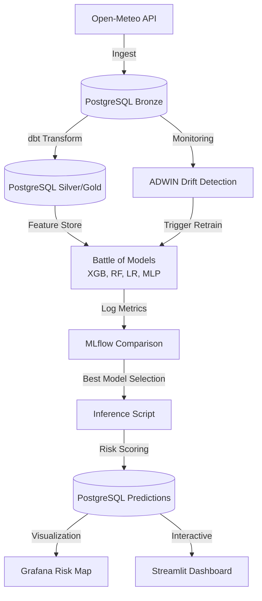

# Samarinda Flood Intelligence - Demo Praktisi Mengajar 🌊

Sistem deteksi dini banjir bertenaga AI untuk **Demo Praktisi Mengajar**. Mengimplementasikan siklus **End-to-End Data Science (EDSL)** menggunakan arsitektur MLOps modern yang efisien (< 8GB RAM).

## 🧬 Arsitektur Sistem (Data Flow)



---

## 🚀 Quick Start (Demo Mode)

Jika Anda baru saja melakukan **`git clone`**, ikuti 3 langkah cepat ini untuk menyalakan seluruh infrastruktur demo:

1.  **Nyalakan Infrastruktur** (Postgres, Airflow, MLflow, Grafana, Streamlit):
    ```bash
    docker-compose up -d
    ```
2.  **Jalankan Pelatihan AI Awal** (Battle of Models):
    *Tunggu 1 menit agar database siap, lalu jalankan:*
    ```bash
    docker exec -u 50000 demo-prediksi-praktisi-mengajar-airflow-scheduler-1 python /opt/airflow/scripts/train_comparison_models.py
    ```
3.  **Akses Dashboard**:
    - **Streamlit**: [http://localhost:8501](http://localhost:8501) (Peta Risiko & Performa AI)
    - **MLflow**: [http://localhost:5001](http://localhost:5001) (Metrik Eksperimen)
    - **Airflow**: [http://localhost:8080](http://localhost:8080) (Orkestrasi Pipeline)

---

## 🛠️ Persiapan Awal & Clone

Sebelum menjalankan proyek, pastikan Anda telah menginstal **Git** di komputer Anda. Ikuti panduan sesuai sistem operasi Anda:

### 1. Instalasi Git
- **Windows**: Unduh installer dari [git-scm.com](https://git-scm.com/download/win). Jalankan `.exe` dan ikuti instruksi.
- **macOS**: Buka Terminal dan ketik `git install`. Atau gunakan Homebrew: `brew install git`.
- **Linux (Ubuntu/Debian)**: `sudo apt update && sudo apt install git -y`.

### 2. Clone Repositori
Buka terminal/git bash, lalu jalankan:
```bash
git clone https://github.com/amsopian22/demo-praktisi-mengajar.git
cd demo-praktisi-mengajar
```

---

## ⚙️ Persiapan Lingkungan (Setup)

### 1. Menyiapkan Lingkungan Python Terisolasi (Venv)
Sesuai aturan operasional, kita wajib memisahkan pustaka AI dengan Python sistem.

1. Buat lingkungan virtual baru (venv):
   ```bash
   python -m venv venv
   ```
2. Aktifkan lingkungan tersebut:
   - **macOS/Linux**: `source venv/bin/activate`
   - **Windows**: `venv\Scripts\activate`
3. Perbarui pip dan instal semua dependensi:
   ```bash
   pip install --upgrade pip
   pip install -r requirements.txt
   ```

### 2. Orkestrasi Kontainerisasi Infrastruktur 
Cukup eksekusi skrip ini untuk meluncurkan seluruh stack (Airflow, MLflow, Grafana, Postgres, pgAdmin):
```bash
chmod +x scripts/deploy_orchestration.sh
./scripts/deploy_orchestration.sh
```

---

## 📊 Siklus Hidup Data Science (EDSL)

### Fase 1: Business Understanding (Demo Praktisi Mengajar)
Proyek ini mendemonstrasikan bagaimana teknologi MLOps memprediksi probabilitas banjir di Samarinda. Fokus utama adalah edukasi alur kerja Data Science dari hulu ke hilir secara otonom.

### Fase 2: Data Acquisition (Ingestion)
Sistem mengambil data cuaca (Curah Hujan, Kelembaban) serta **Data Elevasi (Topografi)** dari Open-Meteo API untuk 59 titik Kelurahan di Samarinda. 

**Proses Teknis:**
- **Asynchronous Ingestion**: Menggunakan `aiohttp` dan `asyncio` untuk mengambil data dari puluhan lokasi secara paralel, mempercepat proses hingga 10x dibanding request sinkron.
- **Date Chunking**: Data historis 5 tahun dibagi menjadi potongan kecil (90 hari per batch) untuk menghindari *memory overload* dan batasan besar paket data dari API.
- **Rate-Limiting & Throttling**: Implementasi jeda (10-30 detik) dan mekanisme *exponential backoff* jika terkena batasan (*429 Rate Limit*) Open-Meteo.
- **Bronze Layer Storage**: Data mentah disimpan ke tabel `bronze_weather_raw` di PostgreSQL menggunakan metode *Bulk Insert* dengan penanganan `ON CONFLICT` (UPSERT) untuk menjamin integritas data tanpa duplikasi.
- **Script**: `scripts/ingest_open_meteo.py`

### Fase 3: Data Preparation (ELT via dbt)
Tahap ini adalah "Dapur Rekayasa Data". Kita menggunakan **dbt (Data Build Tool)** untuk mengubah data mentah menjadi informasi berharga menggunakan bahasa SQL.

**Analogi Dapur (Medallion Architecture):**
*   **Bronze (Bahan Mentah)**: Seperti sayuran yang baru dibeli dari pasar dan masih ada tanahnya. Ini adalah data asli dari API Open-Meteo.
*   **Silver (Bahan Bersih)**: Sayuran yang sudah dicuci dan dipotong-potong. Di sini, data dibersihkan dari nilai kosong (*Null*) dan format tanggal diseragamkan.
*   **Gold (Hidangan Siap Sajian)**: Masakan yang sudah matang dan siap dimakan. Ini adalah **Feature Store**—kumpulan data yang sudah memiliki "Logika Pintar" untuk dikonsumsi Model AI.

**Konsep Penting untuk Mahasiswa:**
1.  **Feature Engineering (Rolling Window)**: Bayangkan jika hari ini hujan lebat, apakah pasti banjir? Belum tentu. Kita perlu melihat "3 hari ke belakang". Jika 3 hari lalu juga hujan, tanah sudah jenuh air. dbt menghitung ini secara otomatis menggunakan *Window Functions* SQL.
2.  **SQL-First**: Kita tidak memindahkan data ke Python untuk diolah (yang memakan RAM besar), melainkan memerintahkan Database PostgreSQL untuk mengolahnya langsung di tempat. Ini jauh lebih cepat dan efisien.
3.  **Proxy Labeling**: Karena kita tidak punya data historis banjir yang lengkap, kita membuat "Label Pintar" sendiri berdasarkan aturan hidrologi (Misal: Jika Hujan > 100mm dan wilayah tersebut rendah, maka beri label 1/Banjir).

### 🧪 Informasi Dataset & Statistik Training
Model dilatih menggunakan data cuaca historis dari 59 Kelurahan di Samarinda dengan rincian statistik berikut:

| Parameter Statistik | Nilai Estimasi |
| :--- | :--- |
| **Total Observasi (Baris)** | ~2.588.448 Baris |
| **Rentang Waktu** | 5 Tahun (Historis) |
| **Jumlah Lokasi (Kelurahan)** | 59 Titik Koordinat |
| **Rasio Kelas (Banjir : Aman)** | **1 : 272** (Extreme Imbalance) |

#### **Daftar Fitur Training (X)**
| Nama Fitur | Deskripsi | Signifikansi |
| :--- | :--- | :--- |
| `elevation_meters` | Ketinggian wilayah (Topografi) | Wilayah rendah (< 10m) lebih rentan banjir. |
| `rainfall_rolling_3d` | Akumulasi curah hujan 3 hari terakhir | Indikator utama kejenuhan tanah. |
| `rainfall_rolling_7d` | Akumulasi curah hujan 7 hari terakhir | Dampak akumulasi air jangka menengah. |
| `rainfall_rolling_14d` | Akumulasi curah hujan 14 hari terakhir | Kondisi hidrologi jangka panjang. |

#### **🧠 Apa itu Proxy Logic?**
Dalam dunia nyata, pencatatan titik banjir historis seringkali tidak lengkap (*sparse*). Untuk melatih model AI, kita menggunakan **Proxy Logic**—sebuah teknik pelabelan berbasis aturan domain hidrologi:

Sistem memberikan label **Banjir (1)** jika memenuhi kriteria "Rainfall vs Elevation" (Contoh: Zona Rendah (< 10m) dengan Hujan 3 hari > 100mm). Teknik ini memungkinkan model mempelajari **pola risiko** berdasarkan interaksi antara topografi dan intensitas hujan, bukan sekadar menghafal kejadian masa lalu.

### Fase 4: Model Training (Battle of Models)
Tahap ini melatih 4 jenis arsitektur AI secara paralel untuk menemukan prediktor banjir terbaik:
- **XGBoost**: Spesialis data tabular tidak seimbang.
- **Random Forest**: Model ensemble yang sangat stabil.
- **Logistic Regression**: Baseline statistik untuk performa cepat.
- **Neural Network (MLP)**: Menangkap pola nonlinear yang kompleks.

**🧬 Glosarium Metrik Evaluasi AI (Mengapa Ini Penting?)**
Dalam sistem prediksi banjir, akurasi saja tidak cukup karena kejadian banjir sangat jarang terjadi (*Imbalanced Data*). Berikut adalah metrik yang kita gunakan untuk mengukur "kecerdasan" model:

1.  **Precision (Presisi - Ketepatan)**:
    - *Tanya:* "Dari semua peringatan banjir yang dikeluarkan AI, berapa banyak yang benar-benar terjadi?"
    - *Pentingnya:* Menghindari **False Alarm** (Alarm Palsu). Precision yang rendah berarti warga disuruh mengungsi padahal tidak ada banjir, yang bisa menurunkan kepercayaan publik.
2.  **Recall (Sensitivitas - Jangkauan)**:
    - *Tanya:* "Dari semua kejadian banjir yang sesungguhnya terjadi, berapa banyak yang berhasil dideteksi AI?"
    - *Pentingnya:* Menghindari **Missed Event**. Recall yang rendah berarti ada banjir yang tidak terdeteksi, yang berisiko menyebabkan jatuhnya korban atau kerugian karena warga tidak bersiap.
3.  **F1-Score (Ekuilibrium)**:
    - *Definisi:* Rata-rata harmonis antara Precision dan Recall.
    - *Pentingnya:* Ini adalah **metrik utama** kita. Karena kita ingin meminimalkan False Alarm (Precision) SEKALIGUS meminimalkan Missed Event (Recall), F1-Score memberikan angka tunggal yang merepresentasikan keseimbangan kedua hal tersebut.
4.  **AUC-ROC (Area Under the Curve)**:
    - *Tanya:* "Seberapa jago AI membedakan antara titik yang aman vs titik yang berisiko banjir di seluruh Samarinda?"
    - *Nilai:* 0.5 (Tebakan acak) hingga 1.0 (Sempurna). AUC memberitahu kita seberapa stabil model secara keseluruhan tanpa terpaku pada satu ambang batas (*threshold*) tertentu.

### Fase 5: Deployment & Inference
Model yang sudah pintar tidak boleh hanya diam di komputer. Ia harus bekerja!

**Konsep Penting untuk Mahasiswa:**
1.  **Analogi Jam Weker (Airflow)**: Apache Airflow bertindak sebagai "Manager Operasional" atau Jam Weker raksasa yang membangunkan sistem setiap jam untuk mengambil cuaca terbaru dan memberikannya ke AI untuk dinilai risikonya.
2.  **Inference (Si Tukang Ramal)**: Skrip `predict_flood.py` mengambil model terbaik dari MLflow dan melakukan "Scoring" secara real-time. Hasilnya disimpan ke tabel `gold_flood_predictions`.

### Fase 6: Monitoring & Visualization
Ini adalah tahap akhir di mana hasil kerja AI bisa dinikmati oleh manusia (Operator).

**Konsep Penting untuk Mahasiswa:**
-   **Dashboard Intelijen Modern (Streamlit)**: Menu simulasi baru yang mendukung:
    -   **Peta Risiko 2D Modern**: Visualisasi titik risiko dengan skema warna *neon* di atas peta radar gelap.
    -   **Model Lab Selection**: Fitur beralih "Otak AI" secara instan untuk melihat variasi prediksi.
    -   **Radar Performance Profile**: Grafik evaluasi performa model yang komprehensif.

---
## 🖼️ Galeri Antarmuka Sistem
````carousel

<!-- slide -->

<!-- slide -->

<!-- slide -->

````

---
## 🚀 Panduan Akses Layanan

| Layanan | URL | Fungsi Utama |
| :--- | :--- | :--- |
| **Airflow** | `http://localhost:8080` | Manager Operasional (*Orchestrator*) |
| **Grafana** | `http://localhost:3001` | Dashboard Visual (*Observability*) |
| **Streamlit** | `http://localhost:8501` | Dashboard Simulasi (*Interactive Analysis*) |
| **MLflow** | `http://localhost:5001` | Laboratorium Percobaan (*Tracking*) |
| **pgAdmin** | `http://localhost:5050` | Gudang Data (*Database Mgmt*) |

---
**Demo Praktisi Mengajar - Intelijen Prediksi Banjir Samarinda Terpadu.**
