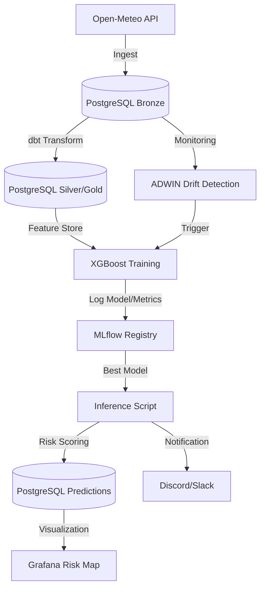

# Samarinda Flood Intelligence - Demo Praktisi Mengajar 🌊

Sistem deteksi dini banjir bertenaga AI untuk **Demo Praktisi Mengajar**. Mengimplementasikan siklus **End-to-End Data Science (EDSL)** menggunakan arsitektur MLOps modern yang efisien (< 8GB RAM).

## 🧬 Arsitektur Sistem (Data Flow)



---

## 🛠️ Persiapan Lingkungan (Setup)

### 1. Menyiapkan Lingkungan Python Terisolasi (Venv)
Sesuai aturan operasional, kita wajib memisahkan pustaka AI dengan Python sistem.

1. Buat lingkungan virtual baru (venv):
   ```bash
   python -m venv venv
   ```
2. Aktifkan lingkungan tersebut:
   - **macOS/Linux**: `source venv/bin/activate`
   - **Windows**: `venv\Scripts\activate`
3. Perbarui pip dan instal semua dependensi:
   ```bash
   pip install --upgrade pip
   pip install -r requirements.txt
   ```

### 2. Orkestrasi Kontainerisasi Infrastruktur 
Cukup eksekusi skrip ini untuk meluncurkan seluruh stack (Airflow, MLflow, Grafana, Postgres, pgAdmin):
```bash
chmod +x scripts/deploy_orchestration.sh
./scripts/deploy_orchestration.sh
```

---

## 📊 Siklus Hidup Data Science (EDSL)

### Fase 1: Business Understanding (Demo Praktisi Mengajar)
Proyek ini mendemonstrasikan bagaimana teknologi MLOps memprediksi probabilitas banjir di Samarinda. Fokus utama adalah edukasi alur kerja Data Science dari hulu ke hilir secara otonom.

### Fase 2: Data Acquisition (Ingestion)
Sistem mengambil data cuaca (Curah Hujan, Kelembaban) serta **Data Elevasi (Topografi)** dari Open-Meteo API untuk 59 titik Kelurahan di Samarinda. 

**Proses Teknis:**
- **Asynchronous Ingestion**: Menggunakan `aiohttp` dan `asyncio` untuk mengambil data dari puluhan lokasi secara paralel, mempercepat proses hingga 10x dibanding request sinkron.
- **Date Chunking**: Data historis 5 tahun dibagi menjadi potongan kecil (90 hari per batch) untuk menghindari *memory overload* dan batasan besar paket data dari API.
- **Rate-Limiting & Throttling**: Implementasi jeda (10-30 detik) dan mekanisme *exponential backoff* jika terkena batasan (*429 Rate Limit*) Open-Meteo.
- **Bronze Layer Storage**: Data mentah disimpan ke tabel `bronze_weather_raw` di PostgreSQL menggunakan metode *Bulk Insert* dengan penanganan `ON CONFLICT` (UPSERT) untuk menjamin integritas data tanpa duplikasi.
- **Script**: `scripts/ingest_open_meteo.py`

### Fase 3: Data Preparation (ELT via dbt)
Tahap ini adalah "Dapur Rekayasa Data". Kita menggunakan **dbt (Data Build Tool)** untuk mengubah data mentah menjadi informasi berharga menggunakan bahasa SQL.

**Analogi Dapur (Medallion Architecture):**
*   **Bronze (Bahan Mentah)**: Seperti sayuran yang baru dibeli dari pasar dan masih ada tanahnya. Ini adalah data asli dari API Open-Meteo.
*   **Silver (Bahan Bersih)**: Sayuran yang sudah dicuci dan dipotong-potong. Di sini, data dibersihkan dari nilai kosong (*Null*) dan format tanggal diseragamkan.
*   **Gold (Hidangan Siap Sajian)**: Masakan yang sudah matang dan siap dimakan. Ini adalah **Feature Store**—kumpulan data yang sudah memiliki "Logika Pintar" untuk dikonsumsi Model AI.

**Konsep Penting untuk Mahasiswa:**
1.  **Feature Engineering (Rolling Window)**: Bayangkan jika hari ini hujan lebat, apakah pasti banjir? Belum tentu. Kita perlu melihat "3 hari ke belakang". Jika 3 hari lalu juga hujan, tanah sudah jenuh air. dbt menghitung ini secara otomatis menggunakan *Window Functions* SQL.
2.  **SQL-First**: Kita tidak memindahkan data ke Python untuk diolah (yang memakan RAM besar), melainkan memerintahkan Database PostgreSQL untuk mengolahnya langsung di tempat. Ini jauh lebih cepat dan efisien.
3.  **Proxy Labeling**: Karena kita tidak punya data historis banjir yang lengkap, kita membuat "Label Pintar" sendiri berdasarkan aturan hidrologi (Misal: Jika Hujan > 100mm dan wilayah tersebut rendah, maka beri label 1/Banjir).

### 🧪 Informasi Dataset & Statistik Training
Model dilatih menggunakan data cuaca historis dari 59 Kelurahan di Samarinda dengan rincian statistik berikut:

| Parameter Statistik | Nilai Estimasi |
| :--- | :--- |
| **Total Observasi (Baris)** | ~2.588.448 Baris |
| **Rentang Waktu** | 5 Tahun (Historis) |
| **Jumlah Lokasi (Kelurahan)** | 59 Titik Koordinat |
| **Rasio Kelas (Banjir : Aman)** | **1 : 272** (Extreme Imbalance) |

#### **Daftar Fitur Training (X)**
| Nama Fitur | Deskripsi | Signifikansi |
| :--- | :--- | :--- |
| `elevation_meters` | Ketinggian wilayah (Topografi) | Wilayah rendah (< 10m) lebih rentan banjir. |
| `rainfall_rolling_3d` | Akumulasi curah hujan 3 hari terakhir | Indikator utama kejenuhan tanah. |
| `rainfall_rolling_7d` | Akumulasi curah hujan 7 hari terakhir | Dampak akumulasi air jangka menengah. |
| `rainfall_rolling_14d` | Akumulasi curah hujan 14 hari terakhir | Kondisi hidrologi jangka panjang. |

#### **🧠 Apa itu Proxy Logic?**
Dalam dunia nyata, pencatatan titik banjir historis seringkali tidak lengkap (*sparse*). Untuk melatih model AI, kita menggunakan **Proxy Logic**—sebuah teknik pelabelan berbasis aturan domain hidrologi:

Sistem memberikan label **Banjir (1)** jika memenuhi kriteria "Rainfall vs Elevation" (Contoh: Zona Rendah (< 10m) dengan Hujan 3 hari > 100mm). Teknik ini memungkinkan model mempelajari **pola risiko** berdasarkan interaksi antara topografi dan intensitas hujan, bukan sekadar menghafal kejadian masa lalu.

### Fase 4: Modeling & Evaluation (XGBoost)
Tahap ini adalah saat AI "belajar" dari data. Kita menggunakan algoritma **XGBoost (eXtreme Gradient Boosting)**.

#### **🤔 Kenapa Menggunakan XGBoost?**
1.  **Raja Data Tabular**: Untuk data berbentuk tabel (seperti cuaca), XGBoost saat ini adalah salah satu yang terbaik di dunia, bahkan sering mengalahkan Deep Learning.
2.  **Efisiensi Tinggi**: Sangat cepat dan irit memori, sesuai dengan target sistem kita yang harus berjalan di bawah **8GB RAM**.
3.  **Tangangguh terhadap Data Bolong**: Cuaca lapangan seringkali memiliki data yang hilang (*Missing Values*). XGBoost punya kemampuan internal untuk menangani data yang tidak lengkap secara otomatis.

#### **💡 Cara Kerja XGBoost (Analogi "Belajar dari Kesalahan")**
Bayangkan sebuah kelas yang berisi 100 murid (Tree/Pohon Keputusan):
-   **Murid ke-1** mencoba menebak apakah akan banjir. Hasilnya lumayan, tapi dia salah menebak di wilayah yang datar.
-   **Murid ke-2** tidak mengulangi pekerjaan murid pertama dari nol. Dia khusus **fokus mempelajari kesalahan** murid pertama (wilayah datar).
-   **Murid ke-3** fokus mempelajari kesalahan gabungan murid ke-1 dan ke-2.
-   **Hasil Akhir**: Jawaban final adalah gabungan pendapat ke-100 murid tersebut, di mana setiap murid baru bertugas memperbaiki kesalahan murid sebelumnya. Inilah yang disebut dengan **Boosting**.

**Konsep Penting lainnya:**
1.  **Analogi Latihan Ujian (Chronological Splitting)**: Model melatih diri pada data masa lalu (2019-2023) dan diuji pada "Ujian Akhir" di tahun 2024 untuk memastikan ia bisa memprediksi masa depan, bukan sekadar menghafal.
2.  **Menangani Data Langka (Scale Pos Weight)**: Karena banjir adalah kejadian langka (1:272), kita memberikan "instruksi khusus" agar AI memberikan perhatian ekstra pada label banjir (memberi bobot tinggi).
3.  **Laboratorium Digital (MLflow)**: Semua percobaan latihan dicatat otomatis agar kita bisa membandingkan akurasi antar "angkatan" model.

### Fase 5: Deployment & Inference
Model yang sudah pintar tidak boleh hanya diam di komputer. Ia harus bekerja!

**Konsep Penting untuk Mahasiswa:**
1.  **Analogi Jam Weker (Airflow)**: Apache Airflow bertindak sebagai "Manager Operasional" atau Jam Weker raksasa yang membangunkan sistem setiap jam untuk mengambil cuaca terbaru dan memberikannya ke AI untuk dinilai risikonya.
2.  **Inference (Si Tukang Ramal)**: Skrip `predict_flood.py` mengambil model terbaik dari MLflow dan melakukan "Scoring" secara real-time. Hasilnya disimpan ke tabel `gold_flood_predictions`.

### Fase 6: Monitoring & Visualization
Ini adalah tahap akhir di mana hasil kerja AI bisa dinikmati oleh manusia (Operator).

**Konsep Penting untuk Mahasiswa:**
1.  **Analogi Menara Kontrol (Grafana)**: Grafana adalah layar monitor Pilot. Kita mengubah angka-angka rumit menjadi Peta Interaktif. Jika risiko > 70%, titik di peta akan berubah menjadi **MERAH**, memberi tahu operator untuk segera bertindak.
2.  **Detektor Asap (ADWIN Drift Detection)**: Iklim bisa berubah (Data Drift). Jika pola hujan mendadak tidak wajar dibanding data latihan, algoritma ADWIN akan berbunyi seperti detektor asap, memerintahkan Airflow untuk melakukan **Retraining** (belajar ulang) agar model tidak ketinggalan zaman.

## 🛠️ Persiapan Awal & Clone

Sebelum menjalankan proyek, pastikan Anda telah menginstal **Git** di komputer Anda. Ikuti panduan sesuai sistem operasi Anda:

### 1. Instalasi Git
- **Windows**: Unduh installer dari [git-scm.com](https://git-scm.com/download/win). Jalankan `.exe` dan ikuti instruksi (direkomendasikan pilih "Git Bash" saat instalasi).
- **macOS**: Buka Terminal dan ketik `git --version`. Jika belum ada, sistem akan menawarkan instalasi otomatis Xcode Command Line Tools. Atau gunakan Homebrew: `brew install git`.
- **Linux (Ubuntu/Debian)**: Jalankan perintah berikut di terminal:
  ```bash
  sudo apt update
  sudo apt install git -y
  ```

### 2. Clone Repositori
Setelah Git terinstal, buat folder baru di komputer Anda, buka terminal/git bash, lalu jalankan:
```bash
git clone https://github.com/amsopian22/demo-praktisi-mengajar.git
cd demo-praktisi-mengajar
```

---
## ⚙️ Cara Menjalankan Proyek

````carousel

<!-- slide -->

<!-- slide -->

<!-- slide -->

````

---
## 🚀 Panduan Akses Layanan

| Layanan | URL | Fungsi Utama |
| :--- | :--- | :--- |
| **Airflow** | `http://localhost:8080` | Manager Operasional (*Orchestrator*) |
| **Grafana** | `http://localhost:3001` | Dashboard Visual (*Observability*) |
| **MLflow** | `http://localhost:5001` | Laboratorium Percobaan (*Tracking*) |
| **pgAdmin** | `http://localhost:5050` | Gudang Data (*Database Mgmt*) |

---
**Demo Praktisi Mengajar - Intelijen Prediksi Banjir Samarinda Terpadu.**
